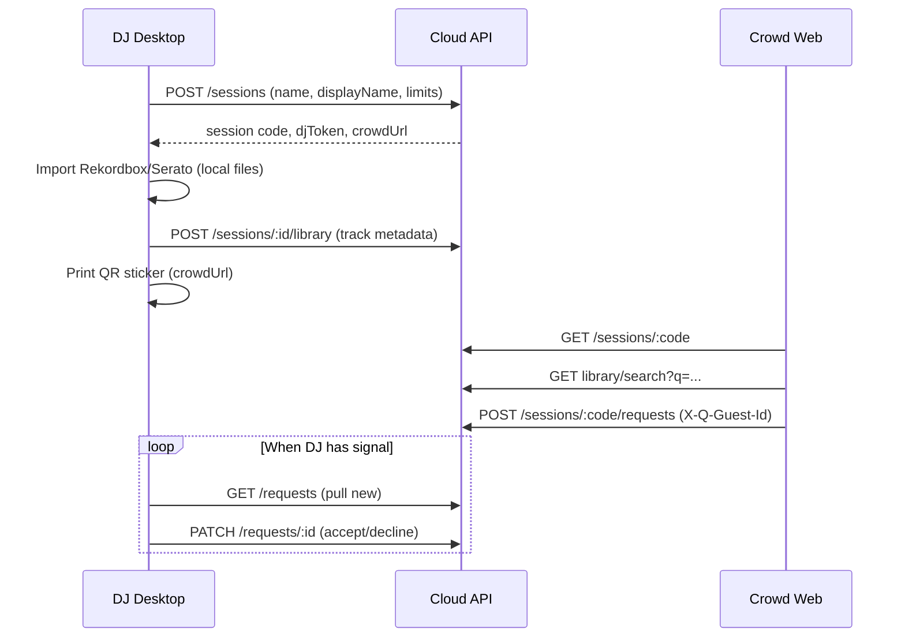

# Q

**Q** is a two-sided DJ request platform: the crowd requests tracks via QR on their own mobile data; the DJ runs a local-first command center on Mac/Windows with Rekordbox/Serato library sync, accept/decline control, and optional offline booth operation.

> This document is the **product requirements + technical diagnosis** for the repo. If chat history is lost after moving folders, start here.

### Where this project lives

| What | Path |
|------|------|
| **Source code (open this in Cursor)** | `C:\Users\ayesh\Documents\Q` |
| **Cursor metadata** (terminals, chat, etc.) | `C:\Users\ayesh\.cursor\projects\c-Users-ayesh-Documents-Q` (auto-created when you open the folder above) |

Do **not** keep product code under `.cursor\projects\...\Temp-...` — that happens when Cursor opens a temp workspace. Always use **File → Open Folder → Documents\Q**.

---

## Table of contents

1. [Vision & problem](#vision--problem)
2. [Users & jobs to be done](#users--jobs-to-be-done)
3. [Product requirements (PRD)](#product-requirements-prd)
4. [How it works (flows)](#how-it-works-flows)
5. [Offline & sync model](#offline--sync-model)
6. [Architecture](#architecture)
7. [Monorepo map](#monorepo-map)
8. [API reference (summary)](#api-reference-summary)
9. [What is built vs missing (diagnosis)](#what-is-built-vs-missing-diagnosis)
10. [Local development](#local-development)
11. [Environment variables](#environment-variables)
12. [Roadmap & priorities](#roadmap--priorities)
13. [Open product decisions](#open-product-decisions)
14. [Recent implementation notes](#recent-implementation-notes)

---

## Vision & problem

### Problem

DJs at gigs get unstructured song requests (shouting, DMs, illegible notes). Venue Wi‑Fi is often unusable. DJs work **offline** with USB/local libraries (Rekordbox, Serato) and cannot risk cloud uploads of their music files. Crowd still has **LTE** and can use a simple web page.

### Solution

| Side | Product | Role |
|------|---------|------|
| **Crowd** | Mobile web (`/r/:code`) | Search DJ library (or request manually), submit requests |
| **DJ** | Desktop app (Tauri) | Import library, QR sticker, queue, accept/decline, sync |
| **Cloud** | API | Sessions, library index (metadata only), request queue |
| **Marketing** | Public website | Explain product, pricing, download |

**Core principles**

- **Music never leaves the laptop** — only track metadata (title, artist, BPM, key) syncs to cloud for search.
- **DJ works offline at the booth** — accept/decline and library import work without internet; **Sync now** over phone hotspot when ready.
- **Crowd uses their own data** — no venue Wi‑Fi required.
- **No accounts for v1** — download app → start gig → get session QR. Accounts deferred until billing / permanent URLs.

---

## Users & jobs to be done

### DJ (primary)

| Job | Success |
|-----|---------|
| Start a gig in 60 seconds | Session code + crowd URL + QR sticker |
| Import tonight’s library | Rekordbox XML or Serato crates from USB/local paths |
| Control the firehose | Request limits, accept/decline, see in-stock vs out-of-stock |
| Work offline mid-set | Decisions queued locally; sync when hotspot available |
| Stay out of the way | Pin window on top; compact sidebar UI (desktop) |

### Crowd (secondary)

| Job | Success |
|-----|---------|
| Scan QR at the booth | Land on request page for this gig |
| Find a song they know | Search indexed library |
| Submit without friction | Clear confirmation; respect per-person limits |
| Not need venue Wi‑Fi | Works on LTE |

### Operator / you (builder)

| Job | Success |
|-----|---------|
| Run full stack locally | API + crowd + web + desktop |
| Ship installers | Tauri build for Mac/Windows |
| Deploy | API + crowd + web on real domains |

---

## Product requirements (PRD)

### P0 — Must work for a real gig (MVP)

| ID | Requirement | Status |
|----|-------------|--------|
| P0-1 | DJ creates a **session** (gig) without sign-in | ✅ |
| P0-2 | Session gets unique **code** + **crowd URL** + **QR sticker** | ✅ |
| P0-3 | DJ imports **Rekordbox** or **Serato** library (metadata) | ✅ |
| P0-4 | Library metadata syncs to API for crowd **search** | ✅ |
| P0-5 | Crowd submits requests; DJ sees **pending queue** | ✅ (via sync) |
| P0-6 | DJ **accepts** or **declines** each request | ✅ |
| P0-7 | Requests matched to library show **in stock** / else **out of stock** | ✅ |
| P0-8 | DJ can operate **offline**; decisions queue locally | ✅ |
| P0-9 | **Sync now** pulls requests + pushes decisions + library | ✅ |
| P0-10 | **Request limits** (queue cap + per-guest cap) | ✅ |
| P0-11 | QR shows **DJ display name** in center (Venmo-style) | ✅ |
| P0-12 | **Downloadable** desktop app (installer) | ⚠️ Build exists (`tauri:build`); not shipped |
| P0-13 | Deployed API + crowd so QR works off localhost | ❌ |

### P1 — Polish & trust

| ID | Requirement | Status |
|----|-------------|--------|
| P1-1 | Marketing site with scroll hero (PNG frame animation) | ✅ |
| P1-2 | Pin window **always on top** (Tauri) | ✅ |
| P1-3 | Compact / side-dock DJ layout | ❌ |
| P1-4 | Block or restrict “request anyway” (out-of-stock) | ❌ (allowed today) |
| P1-5 | Real download links on marketing site | ❌ |
| P1-6 | Auto-sync interval tuning / backoff | ⚠️ (4s poll when online) |

### P2 — Growth & monetization

| ID | Requirement | Status |
|----|-------------|--------|
| P2-1 | DJ **accounts** + permanent QR (`/@handle`) | ❌ |
| P2-2 | **Q Pro** — AI transition suggestions | ⚠️ Stub only |
| P2-3 | **Traktor** library adapter | ❌ |
| P2-4 | Payments / subscription | ❌ |

### Non-goals (v1)

- Uploading audio files to cloud
- Browser extension (desktop app is the right surface)
- Crowd offline mode (they need LTE to reach API)
- Rekordbox/Serato live deck control

---

## How it works (flows)

### End-to-end gig flow



### Session vs permanent QR

| Model | When | Q today |
|-------|------|---------|
| **Per session (gig)** | New code each night; clean queue | ✅ Recommended v1 |
| **Per DJ (brand)** | Same QR forever; needs accounts | ❌ Future |

QR encodes `crowdUrl` → e.g. `http://localhost:5173/r/ABC123` (prod: `https://q.app/r/ABC123`).

### Request limits (implemented)

| Limit | Default | Enforced |
|-------|---------|----------|
| Max **pending** in DJ queue | 20 | API returns 429 `queue_full` |
| Max requests **per guest** (browser) | 3 | API uses `X-Q-Guest-Id` header |

DJ configures before **Start gig** and can edit mid-set (sidebar → saved via `PATCH /sessions/:id/settings`).

### In-stock logic

- Crowd picks from **search** → `trackId` sent → **in stock** if ID exists in session library.
- Crowd uses **manual request** → title/artist matched against library → in stock if exact match; else **out of stock** (DJ can still decline).
- DJ always has final say via accept/decline.

---

## Offline & sync model

```
Crowd (LTE)  ──always online to API──►  Cloud API  ◄──sync when possible──  DJ laptop (often offline)
```

| Action | Offline? | Where stored |
|--------|----------|--------------|
| Import library | ✅ | Local + queued in `localStorage` outbox |
| Accept/decline | ✅ | Local UI + outbox (`q-outbox`) |
| Crowd submit | ❌ needs API | Server SQLite |
| Pull new requests | ❌ needs API | Merged into desktop state |

**Sync engine** (`apps/desktop/src/sync/engine.ts`):

1. Push queued library upload (if any)
2. Push queued accept/decline decisions
3. Pull requests (`since` timestamp for incremental)
4. Merge server + local (pending local decisions win)

**Auto-sync:** every 4s when `navigator.onLine` and gig active. **Sync now** button forces full pull.

---

## Architecture

```
┌─────────────────────────────────────────────────────────────────┐
│                         MONOREPO (npm workspaces)                │
├─────────────┬─────────────┬─────────────┬─────────────────────────┤
│  apps/web   │ apps/crowd  │ apps/api    │ apps/desktop (Tauri)    │
│  Vite+React │ Vite+React  │ Hono+SQLite │ Vite+React + Rust shell │
│  :5174      │  :5173      │  :8787      │  :1420 (dev)            │
├─────────────┴─────────────┴─────────────┴─────────────────────────┤
│  packages/shared   packages/rekordbox   packages/serato           │
│  (types)           (XML parser)         (crate parser)            │
└─────────────────────────────────────────────────────────────────┘
```

### Auth model (v1)

- **No user accounts.**
- Each session has a secret **`djToken`** (Bearer) for DJ-only endpoints.
- Crowd uses public **session code** in URL only.
- Guest identity = anonymous `X-Q-Guest-Id` (UUID in `localStorage`) for rate limits.

### Data store

- API: **SQLite** (`data/q.db` under API cwd, or `Q_DATA_DIR`)
- Desktop: **localStorage** (`q-gig`, `q-outbox`, `q-dj-display-name`)
- No DJ music files on server — only `tracks` metadata rows per session

---

## Monorepo map

| Path | Package | Purpose |
|------|---------|---------|
| `apps/web` | `@q/web` | DJ marketing site, hero scroll animation |
| `apps/crowd` | `@q/crowd` | Crowd request portal `/r/:code` |
| `apps/api` | `@q/api` | REST API, sessions, library, requests |
| `apps/desktop` | `@q/desktop` | Tauri DJ command center |
| `packages/shared` | `@q/shared` | Shared TypeScript types |
| `packages/rekordbox` | `@q/rekordbox` | Parse rekordbox.xml |
| `packages/serato` | `@q/serato` | Parse Serato Subcrates |
| `scripts/generate-hero-manifest.mjs` | — | Regenerate web hero frame manifest |

### Key desktop files

| File | Role |
|------|------|
| `apps/desktop/src/App.tsx` | Main DJ UI, gig lifecycle, queue |
| `apps/desktop/src/components/QrSticker.tsx` | QR + center display name |
| `apps/desktop/src/sync/engine.ts` | Pull/push sync |
| `apps/desktop/src/sync/outbox.ts` | Offline queue (localStorage) |
| `apps/desktop/src-tauri/` | Rust: file read, path detection |

### Key web files

| File | Role |
|------|------|
| `apps/web/src/App.tsx` | Marketing sections |
| `apps/web/src/components/HeroDeckBackdrop.tsx` | Fixed PNG scroll animation |
| `apps/web/src/hooks/useHeroScrollProgress.ts` | Full-page scroll → frame index |

---

## API reference (summary)

Base URL: `http://localhost:8787` (dev)

| Method | Path | Auth | Description |
|--------|------|------|-------------|
| GET | `/health` | — | Health check |
| POST | `/sessions` | — | Create gig; body: `name`, `displayName`, `maxPendingRequests`, `maxRequestsPerGuest` |
| GET | `/sessions/:code` | — | Public session info (crowd) |
| PATCH | `/sessions/:sessionId/settings` | Bearer `djToken` | Update limits / display name |
| POST | `/sessions/:sessionId/library` | Bearer | Upload track metadata array |
| GET | `/sessions/:code/library/search?q=` | — | Crowd search (in-stock results) |
| POST | `/sessions/:code/requests` | `X-Q-Guest-Id` | Submit request |
| GET | `/sessions/:sessionId/requests` | Bearer | DJ pull queue (`?since=` optional) |
| PATCH | `/sessions/:sessionId/requests/:id` | Bearer | Accept / decline |
| GET | `/sessions/:sessionId/sync-status` | Bearer | Pending counts |
| POST | `/auth/register`, `/auth/login` | — | DJ accounts |
| GET | `/mixes/feed` | — | Public mix discovery |
| GET | `/djs/:handle` | — | Public profile + mixes |
| POST | `/auth/mixes` | `X-Q-Account-Token` | Save a mix link |

**Crowd headers:** `X-Q-Guest-Id` (required for POST requests)

**DJ headers:** `Authorization: Bearer <djToken>`, optional `X-Q-Plan: pro|free`, optional `X-Q-Account-Token` when starting a gig while signed in

---

## What is built vs missing (diagnosis)

### ✅ Working today (local dev)

- Full monorepo builds (`npm run build`)
- Session lifecycle + QR sticker (save PNG, print)
- Rekordbox + Serato import (auto-detect paths on Windows/Mac)
- Crowd search + submit + limit errors
- DJ queue + accept/decline + transition suggestions (free tier rules)
- Offline outbox + sync engine
- Marketing site with scroll-driven hero (PNG frames in `apps/web/public/hero/frames/`)
- Request limits + Venmo-style QR center label
- Pin window on top (Tauri only)
- **Community v1:** accounts, mix feed, DJ profiles, studio (link mixes)
- Serato now-playing + queue auto-clear + played-earlier badges

### ⚠️ Partial / dev-only

| Item | Gap |
|------|-----|
| Desktop installer | Needs `npm run tauri:build`; Rust toolchain; icons in `tauri.conf.json` |
| Marketing “Download” | Points to dev instructions, not real binaries |
| Q Pro | UI tease; `ai-suggestions.ts` stubbed |
| 3D hero (`HeroCanvas`, Three.js) | Present in repo but marketing uses PNG frames |
| Crowd “request anyway” | Always allowed; shows out-of-stock |

### ❌ Not built

| Item | Notes |
|------|-------|
| Full account OAuth / email verify | Email+password v1 only |
| Production deploy | [docs/PRODUCTION-DEPLOY.md](docs/PRODUCTION-DEPLOY.md) — Render, Vercel, GitHub Release, Supabase redirects (v0.2.0) |
| Audio hosting for mixes | Link-only (SoundCloud etc.) |
| Traktor adapter | Roadmap |
| Native compact “sidebar” layout | Window resize only today |
| Push notifications to DJ | Sync poll only |

### Common “why doesn’t localhost work?”

1. Dev server not running → run `npm run dev:web` or `npm run dev:stack`
2. Wrong port — web is **5174**, crowd **5173**, API **8787**
3. Opened HTML file directly — must use `http://localhost:...`
4. Cursor Simple Browser — run **Simple Browser: Show** and paste URL; external `start http://` opens system browser

---

## Local development

From **project root** (where this README lives):

```bash
npm install
npm run build -w @q/shared
npm run build -w @q/rekordbox
npm run build -w @q/serato
```

### URLs (local)

| What | URL | Command |
|------|-----|---------|
| DJ marketing site | http://localhost:5174 | `npm run dev:web` |
| Crowd portal | http://localhost:5173/r/YOUR_CODE | `npm run dev:crowd` |
| API | http://localhost:8787 | `npm run dev:api` |
| All three | (above) | `npm run dev:stack` |
| Desktop app | Tauri window | `npm run tauri:dev -w @q/desktop` |

### Phone + LAN (crowd + Q Booth mobile)

1. In `.env`, set `Q_CROWD_URL=http://<your-lan-ip>:5173` (Windows: `ipconfig` → IPv4).  
2. Run `npm run sync:env` — updates `VITE_Q_CROWD_LAN_URL`, `EXPO_PUBLIC_*`, and `apps/booth/.env`.  
3. `npm run dev:stack` — API listens on `0.0.0.0:8787`; crowd on `:5173` with `host: true`.  
4. Phone on same Wi‑Fi: open crowd URL from desktop QR, or Expo **Q Booth** (`npm run dev:booth`).  
5. Crowd on phone uses `/api` proxy automatically (no `localhost` on the device).

| App | Command | Phone URL |
|-----|---------|-----------|
| Crowd (guests) | `npm run dev:stack` | `http://<lan-ip>:5173/r/CODE` |
| Q Booth (DJ HUD) | `npm run dev:booth` | Expo Go → scan terminal QR |
| Desktop | `npm run dev:desktop` | Laptop only; pushes BPM/key to API |

All three surfaces share `@q/theme` tokens (black, Inter, pink/cyan/purple, white CTAs).

### Full gig test checklist

1. `npm run dev:stack` in terminal 1  
2. `npm run dev:desktop` (or `tauri:dev`) in terminal 2  
3. Optional: `npm run dev:booth` in terminal 3 for phone accept/decline  
4. Desktop → sign in → **Start gig** → import library → **Sync now**  
5. Scan QR on phone → search + submit requests (branded crowd UI)  
6. Accept/decline on desktop, overlay, or **Q Booth** app  
7. Optional: laptop offline → accept locally → hotspot → **Sync now**

### Library import paths

| Software | Typical path |
|----------|----------------|
| Rekordbox | `%APPDATA%\Pioneer\rekordbox\rekordbox.xml` (Windows) or `~/Library/.../rekordbox.xml` (Mac) |
| Serato | `Music\_Serato_\Subcrates\*.crate` |

### Build desktop installer

```bash
npm run tauri:build -w @q/desktop
```

Output under `apps/desktop/src-tauri/target/release/bundle/`.

### Hero frame manifest (web)

If PNG frames change:

```bash
npm run hero:frames
```

---

## Environment variables

| Variable | App | Default | Purpose |
|----------|-----|---------|---------|
| `PORT` | API | `8787` | API listen port |
| `Q_DATA_DIR` | API | `./data` | SQLite location |
| `Q_CROWD_URL` | API | `http://localhost:5173` | Base for `crowdUrl` in session response |
| `VITE_Q_API_URL` | desktop, crowd | `http://localhost:8787` (desktop); `/api` (crowd dev proxy) | API base |
| `Q_WEB_URL` | API | `http://localhost:5174` | Profile links in session response |
| `VITE_Q_CROWD_LAN_URL` | desktop | — | LAN IP for scannable QR in dev |

---

## QR sticker — lowest effort for DJs (v1)

**Recommended path:** print yourself — no mailing, no TV required.

1. Start a gig in the **desktop app** (needs internet once).
2. Tap **Save PNG** or **Print** on the QR sticker card.
3. Tape to laptop lid, mixer, or a small tent card at the booth.

| Method | DJ effort | When to use |
|--------|-----------|-------------|
| **Print / Save PNG** | ~2 min | Default — works everywhere |
| Phone hotspot + LAN QR | Dev / same Wi‑Fi | Testing only (`VITE_Q_CROWD_LAN_URL`) |
| TV / tablet at bar | Medium | Optional if venue has a screen |
| Mailed sticker packs | Zero print | Later — after permanent `/@handle` URLs |

**Production:** deploy crowd app so QR uses a real HTTPS URL (LTE). See `Q_CROWD_URL` in `.env`.

**Permanent link (signed-in DJs):** crowd can open `/dj/yourhandle` → redirects to tonight's session code.

Full community / marketplace PRD: [docs/COMMUNITY.md](docs/COMMUNITY.md).

---

## Roadmap & priorities

Recommended order if unsure what to build next:

1. **Prove the loop** — run checklist above; fix whatever breaks  
2. **Ship desktop installer** — `tauri:build`, test on clean machine  
3. **Deploy** — API + crowd (+ web) so QR works on real URLs  
4. **Marketing download** — host installers, update `apps/web` CTA  
5. **Community** — register, add mixes in Studio, share profile link  
6. **Q Pro** — AI transitions when ready to charge  

---

## Open product decisions

| Question | Current lean | Alternative |
|----------|--------------|-------------|
| Session vs permanent QR? | Per session for v1 | Accounts + `/@djname` later |
| Allow out-of-stock requests? | Yes (DJ declines) | Hard block crowd submit |
| Sign-in required? | No for v1 | Email/OAuth for Pro + history |
| Where does music live? | Only on DJ disk | Never upload audio |
| Extension vs desktop? | Desktop (Tauri) | Extension can’t read library offline |

---

## Recent implementation notes

*(Last updated: May 2026 — preserve when moving folders)*

### Marketing hero (`apps/web`)

- Removed `500vh` sticky scroll track; animation tied to **full page scroll** (0 = top, 1 = bottom).
- Deck PNG layer is **`position: fixed`** behind all sections (`HeroDeckBackdrop.tsx`).
- Frame sequence: `public/hero/frames/*.png` + `manifest.json` (`npm run hero:frames`).

### DJ product features

- **Request limits:** `max_pending_requests` (default 20), `max_requests_per_guest` (default 3).
- **QR center label:** `displayName` on session / sticker.
- **Pin on top:** `getCurrentWindow().setAlwaysOnTop()` in desktop (Tauri).
- **Settings API:** `PATCH /sessions/:sessionId/settings`.

### Database migrations

API `db.ts` uses `ALTER TABLE` guards for new columns on existing SQLite files:

- `sessions.display_name`, `max_pending_requests`, `max_requests_per_guest`
- `requests.guest_id`

---

## Production (target)

| Product | Example domain |
|---------|----------------|
| DJ website | `getq.app` |
| Crowd portal | `getq.app/r/:code` |
| API | `api.getq.app` |
| Desktop | Download from marketing site |

---

## Tagline

**Q — queue, not chaos.**
