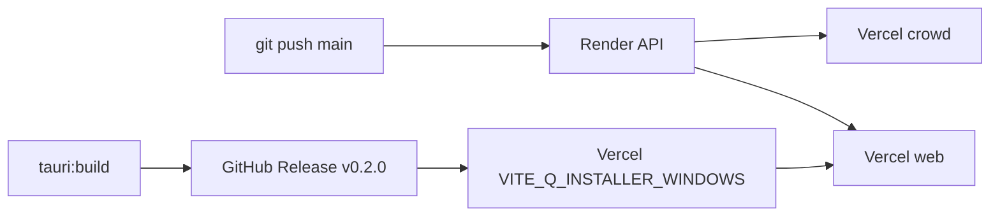

# Production deploy — full checklist (Q v0.2.0)

One-page reference for shipping **API (Render)**, **web + crowd (Vercel)**, **desktop (GitHub Releases)**, and **Supabase redirects**.

Your current production URLs (from `.env.production`):

| Service | URL |
|---------|-----|
| **API** | https://q-api-hp4b.onrender.com |
| **Marketing web** | https://q-web-liart.vercel.app |
| **Download** | https://q-web-liart.vercel.app/download |
| **GitHub repo** | https://github.com/ayesh280504/Q |

If you use a **separate Vercel project** for crowd (`apps/crowd`), set `Q_CROWD_URL` on Render to that URL instead of the web URL.

---

## Version (keep in sync)

**Current release: `0.2.0`**

These files must all say `0.2.0` before you build the installer:

| File |
|------|
| `package.json` (repo root) |
| `apps/desktop/package.json` |
| `apps/desktop/src-tauri/tauri.conf.json` |
| `apps/desktop/src-tauri/Cargo.toml` |
| `apps/web/src/pages/DownloadPage.tsx` → `BOOTH_VERSION` |

After bump: `npm install` at repo root (updates `package-lock.json`).

---

## 0. Pre-flight (local)

```powershell
cd C:\Users\ayesh\Documents\Q
npm install
npm run build -w @q/shared
npm run build -w @q/rekordbox
npm run build -w @q/serato
npm run build -w @q/api
npm run build -w @q/crowd
npm run build -w @q/web
npm run build -w @q/desktop
```

Smoke: `npm run dev:stack` + `npm run dev:desktop` — start gig, phone QR, accept request.

See [PRE-DEPLOY-CHECKLIST.md](./PRE-DEPLOY-CHECKLIST.md).

---

## 1. Git commit + push

```powershell
cd C:\Users\ayesh\Documents\Q
git status
git add -A
git commit -m "Release v0.2.0: unified brand (web, crowd, desktop), mobile booth UI, LAN env sync"
git push origin main
```

Use your real default branch if not `main`.

---

## 2. Render (API) — deploy first

Render should auto-deploy when `main` updates (if the service is linked to GitHub).

**Build / start** (typical):

- Root: repo root or `apps/api`
- Build: `npm install && npm run build -w @q/api`
- Start: `npm run start -w @q/api`

**Required env vars:**

| Variable | Production value |
|----------|------------------|
| `PORT` | `8787` (or Render’s assigned port) |
| `SUPABASE_URL` | `https://jawyjjgwxksnfedpnxnr.supabase.co` |
| `Q_CROWD_URL` | Crowd app URL — e.g. `https://q-web-liart.vercel.app` **or** your crowd-only Vercel URL |
| `Q_WEB_URL` | `https://q-web-liart.vercel.app` |
| `Q_DATA_DIR` | Persistent disk path if you use one, or default |
| `Q_GITHUB_REPO` | `ayesh280504/Q` (desktop auto-updater) |
| `Q_GITHUB_TOKEN` | GitHub PAT with `repo` — only if the repo is private |

**Optional:**

| Variable | Purpose |
|----------|---------|
| `SPOTIFY_CLIENT_ID` / `SPOTIFY_CLIENT_SECRET` | Open Spotify search on crowd |
| `Q_HOST` | `0.0.0.0` (default) — LAN binding |

**Verify:**

```text
GET https://q-api-hp4b.onrender.com/health
```

Updater proxy:

```text
GET https://q-api-hp4b.onrender.com/desktop/update.json?target=windows-x86_64&current_version=0.1.9
```

Expect **200 + JSON** when `v0.2.0` is published on GitHub; **204** if already on latest.

---

## 3. Vercel — web project (`apps/web`)

**Project settings:**

| Setting | Value |
|---------|--------|
| Framework | Vite |
| Root Directory | `apps/web` |
| Build Command | `cd ../.. && npm install && npm run build -w @q/web` |
| Output Directory | `dist` |
| Install Command | (default) |

**Environment variables (Production):**

| Variable | Value |
|----------|--------|
| `VITE_Q_API_URL` | `https://q-api-hp4b.onrender.com` |
| `VITE_Q_WEB_URL` | `https://q-web-liart.vercel.app` |
| `VITE_SUPABASE_URL` | `https://jawyjjgwxksnfedpnxnr.supabase.co` |
| `VITE_SUPABASE_ANON_KEY` | Your Supabase anon key (public by design) |
| `VITE_Q_INSTALLER_WINDOWS` | See below — set **after** GitHub Release |
| `VITE_Q_INSTALLER_MAC` | (optional) Mac `.dmg` URL when you ship Mac |
| `VITE_ENABLE_GOOGLE` | `true` when Google OAuth is configured |
| `VITE_Q_CROWD_URL` | (optional) If crowd is on another domain — profile links |

**Download button (after GitHub Release):**

```text
VITE_Q_INSTALLER_WINDOWS=https://github.com/ayesh280504/Q/releases/download/v0.2.0/Q_0.2.0_x64-setup.exe
```

Redeploy web after changing env (Vercel → Deployments → Redeploy, or push a commit).

**Routes:** `vercel.json` SPA rewrite — `/download`, `/community`, `/login`, etc. all serve `index.html`.

**Deep link (no Vercel config):** Installed app registers `qdj://open` and `qdj://start-gig` on Windows (see [SUPABASE.md](./SUPABASE.md)).

---

## 4. Vercel — crowd project (`apps/crowd`)

Second Vercel project (recommended) so guest QR traffic is separate from marketing site.

| Setting | Value |
|---------|--------|
| Root Directory | `apps/crowd` |
| Build Command | `cd ../.. && npm install && npm run build -w @q/crowd` |
| Output Directory | `dist` |

**Environment variables (Production):**

| Variable | Value |
|----------|--------|
| `VITE_Q_API_URL` | `https://q-api-hp4b.onrender.com` |

Crowd does **not** need Supabase or installer URLs.

**Critical:** `Q_CROWD_URL` on **Render** must match this project’s URL, e.g.:

- `https://your-crowd-project.vercel.app`

QR codes and session links use that host: `https://YOUR-CROWD-URL/r/SESSIONCODE`.

Permanent DJ link: `https://YOUR-CROWD-URL/dj/HANDLE`.

---

## 5. Supabase — redirect URLs

**Authentication → URL configuration → Redirect URLs:**

| URL | Used for |
|-----|----------|
| `https://q-web-liart.vercel.app/auth/callback` | Email confirm + Google OAuth return |
| `https://q-web-liart.vercel.app/reset-password` | Password reset |
| `http://localhost:5174/auth/callback` | Local dev |
| `http://localhost:5174/reset-password` | Local dev |

**Site URL (optional):** `https://q-web-liart.vercel.app`

**Google Cloud** (if enabled): authorized redirect URI =  
`https://jawyjjgwxksnfedpnxnr.supabase.co/auth/v1/callback`

---

## 6. Desktop installer (Windows)

Root `.env.production` is baked into the desktop build:

```env
VITE_Q_API_URL=https://q-api-hp4b.onrender.com
VITE_Q_WEB_URL=https://q-web-liart.vercel.app
VITE_SUPABASE_URL=...
VITE_SUPABASE_ANON_KEY=...
```

**Build (signed updates — required for `.sig`):**

```powershell
cd C:\Users\ayesh\Documents\Q\apps\desktop

$env:TAURI_SIGNING_PRIVATE_KEY = Get-Content "$env:USERPROFILE\.tauri\q-updater.key" -Raw
$env:TAURI_SIGNING_PRIVATE_KEY_PASSWORD = "your-password"

npm run tauri:build
```

**Upload to GitHub Release `v0.2.0`:**

| File | Required? |
|------|-----------|
| `apps\desktop\src-tauri\target\release\bundle\nsis\Q_0.2.0_x64-setup.exe` | Yes — download + updater |
| `apps\desktop\src-tauri\target\release\bundle\nsis\Q_0.2.0_x64-setup.exe.sig` | Yes — auto-update |
| `apps\desktop\src-tauri\target\release\bundle\msi\Q_0.2.0_x64_en-US.msi` | Optional |

```powershell
cd C:\Users\ayesh\Documents\Q
git tag v0.2.0
git push origin v0.2.0
```

GitHub → **Releases** → Draft → tag `v0.2.0` → attach assets → Publish.

Release notes text becomes the in-app “What’s new” banner ([RELEASING.md](./RELEASING.md)).

---

## 7. Q Booth mobile (Expo) — not in store yet

Production API for dev builds / TestFlight later:

```env
EXPO_PUBLIC_Q_API_URL=https://q-api-hp4b.onrender.com
EXPO_PUBLIC_Q_CROWD_URL=https://YOUR-CROWD-VERCEL-URL
```

Run `npm run sync:env` locally only when using LAN IP; for production, set these in `apps/booth/.env` manually or EAS secrets.

---

## 8. Deploy order (summary)



1. Push code → Render + Vercel auto-deploy  
2. Build desktop → GitHub Release `v0.2.0`  
3. Set `VITE_Q_INSTALLER_WINDOWS` on Vercel web → redeploy  
4. Verify download page, QR, crowd request, updater  

---

## 9. Post-deploy verification

| Check | How |
|-------|-----|
| API up | `GET /health` |
| Web home | https://q-web-liart.vercel.app |
| Download | `/download` → `.exe` downloads `Q_0.2.0_x64-setup.exe` |
| Sign in | `/login` → Supabase → `/studio` |
| Start gig (desktop) | QR points at `Q_CROWD_URL` |
| Phone scan | Crowd page loads, search works |
| Request → accept | Desktop or Q Booth app |
| Updater | Old install shows banner for 0.2.0 |

---

## npm scripts reference

| Command | What it does |
|---------|----------------|
| `npm run dev:stack` | API + crowd + web (local) |
| `npm run dev:desktop` | Tauri dev window |
| `npm run dev:booth` | Expo mobile HUD |
| `npm run sync:env` | LAN IP → `.env` + `apps/booth/.env` |
| `npm run build` | Shared libs + api + crowd + web |
| `npm run build:desktop` | Vite build only (no installer) |
| `npm run tauri:build -w @q/desktop` | Windows installer + `.sig` |

---

## Related docs

- [RELEASE-0.2.0.md](./RELEASE-0.2.0.md) — copy-paste commands for this release  
- [RELEASING.md](./RELEASING.md) — signing keys + updater troubleshooting  
- [SUPABASE.md](./SUPABASE.md) — auth redirects  
- [PRE-DEPLOY-CHECKLIST.md](./PRE-DEPLOY-CHECKLIST.md) — local testing before ship  
