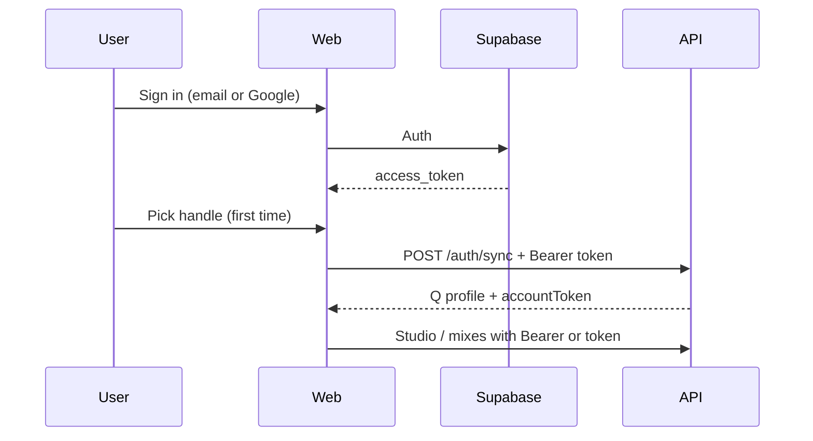

# Supabase Auth setup for Q

Q uses **Supabase Auth** for permanent accounts (email + Google). Your DJ profile, mixes, and gig links are stored in the Q API database and linked to your Supabase user id.

## 1. Create a Supabase project

1. Go to [supabase.com](https://supabase.com) → New project.
2. Note your **Project URL** and **anon public** key (Settings → API).

## 2. Enable auth providers

In **Authentication → Providers**:

| Provider | Action |
|----------|--------|
| **Email** | Enabled (confirm email on or off — if on, users must click the link before first sign-in) |
| **Google** | Enable, add OAuth client ID/secret from [Google Cloud Console](https://console.cloud.google.com/) |

### Google OAuth redirect URLs

Add these under **Authentication → URL configuration**:

| Environment | Redirect URL |
|-------------|----------------|
| Local web | `http://localhost:5174/auth/callback` |
| Production | `https://YOUR-WEB-DOMAIN/auth/callback` |

In Google Cloud, authorized redirect URI must be:

`https://YOUR-PROJECT-REF.supabase.co/auth/v1/callback`

## 3. Environment variables

Root `.env` (and Vercel/Render env for production):

```env
# API — verifies Supabase JWTs
SUPABASE_URL=https://YOUR-PROJECT-REF.supabase.co

# Web app
VITE_SUPABASE_URL=https://YOUR-PROJECT-REF.supabase.co
VITE_SUPABASE_ANON_KEY=your-anon-key
VITE_Q_API_URL=http://localhost:8787
VITE_Q_WEB_URL=http://localhost:5174
```

Restart `npm run dev:stack` and the web app after changing env.

## 4. How sign-in works



- **First Google sign-in:** `/welcome` → choose handle → studio tour.
- **Email register:** handle on register form when possible; otherwise `/welcome`.
- **Desktop:** still supports email/password via API token; sign in on web with Supabase for the same email to link accounts.

## 5. Without Supabase (dev fallback)

If `VITE_SUPABASE_URL` is unset, the website uses legacy **API-only** email/password (`/auth/register`, `/auth/login`). Supabase is recommended before production.

## 6. Moving SQLite users to Supabase later

Existing local SQLite users can sign up in Supabase with the **same email**; `POST /auth/sync` links `supabase_id` to the existing row.

## 7. Postgres (optional, later)

Booth sessions/requests can stay on SQLite or Render Postgres initially. User/mix tables can migrate to Supabase Postgres when you want one database — Auth users already live in Supabase.
