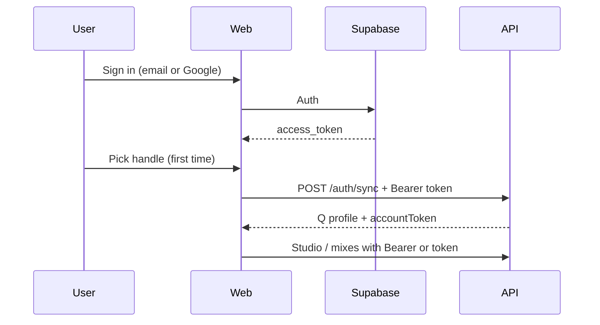

# Supabase Auth setup for Q

Q uses **Supabase Auth** for permanent accounts (email + Google). Your DJ profile, mixes, and gig links are stored in the Q API database and linked to your Supabase user id.

## 1. Create a Supabase project

1. Go to [supabase.com](https://supabase.com) → New project.
2. Note your **Project URL** and **anon public** key (Settings → API).

## 2. Enable auth providers

In **Authentication → Providers**:

| Provider | Action |
|----------|--------|
| **Email** | Enabled — turn **Confirm email** ON for signup codes |
| **Google** | Optional later — set `VITE_ENABLE_GOOGLE=true` in `.env` when ready |

### Google OAuth redirect URLs

Add these under **Authentication → URL configuration**:

| Environment | Redirect URL |
|-------------|----------------|
| Local web | `http://localhost:5174/auth/callback` |
| Production | `https://YOUR-WEB-DOMAIN/auth/callback` |

In Google Cloud, authorized redirect URI must be:

`https://YOUR-PROJECT-REF.supabase.co/auth/v1/callback`

## 3. Environment variables

Root `.env` (and Vercel/Render env for production):

```env
# API — verifies Supabase JWTs
SUPABASE_URL=https://YOUR-PROJECT-REF.supabase.co

# Web app
VITE_SUPABASE_URL=https://YOUR-PROJECT-REF.supabase.co
VITE_SUPABASE_ANON_KEY=your-anon-key
VITE_Q_API_URL=http://localhost:8787
VITE_Q_WEB_URL=http://localhost:5174
```

Restart `npm run dev:stack` and the web app after changing env.

**Important:** `.env` must live at the **repo root** (`Q/.env`). Vite loads it from there for `apps/web` and `apps/desktop`.

### Register page checks

On http://localhost:5174/register you should see **Continue with Google**. If you only see email/password and no Google button, Supabase env vars are not loaded — fix `.env` and restart `dev:stack`.

### Email verification (6-digit code) — required for signup

1. **Authentication → Providers → Email** → enable **Confirm email**.
2. **Authentication → Email Templates → Confirm signup** — ensure the body includes the OTP token, e.g.:

   ```text
   Your Q verification code is: {{ .Token }}
   ```

   (Supabase sends a 6-digit `{{ .Token }}` when confirmations use OTP.)

3. **Authentication → URL configuration** — add redirect URLs:
   - `http://localhost:5174/auth/callback`
   - `http://localhost:5174/reset-password`

4. User flow: **Register** → `/verify-email` → enter code → Studio. User also appears under **Authentication → Users** after verification.

### Forgot password

1. **Authentication → Email Templates → Reset password** — include `{{ .Token }}` if you want code entry (same as signup).
2. User flow: **Forgot password** → email → enter code on site **or** open link → **Reset password** page.

### No email / user not in Supabase?

| Cause | Fix |
|-------|-----|
| Confirm email OFF | Turn ON in Supabase |
| `.env` not loaded | Restart `npm run dev:stack`; see **Continue with Google** hidden = OK |
| Registered on **desktop** only | Use http://localhost:5174/register |
| Registered before env fix | Sign up again on web with Supabase wired |

Desktop **Register** still uses the local API unless you sign up on the **website** first.

## 4. How sign-in works



- **First Google sign-in:** `/welcome` → choose handle → studio tour.
- **Email register:** handle on register form when possible; otherwise `/welcome`.
- **Desktop:** still supports email/password via API token; sign in on web with Supabase for the same email to link accounts.

## 5. Without Supabase (dev fallback)

If `VITE_SUPABASE_URL` is unset, the website uses legacy **API-only** email/password (`/auth/register`, `/auth/login`). Supabase is recommended before production.

## 6. Moving SQLite users to Supabase later

Existing local SQLite users can sign up in Supabase with the **same email**; `POST /auth/sync` links `supabase_id` to the existing row.

## 7. Postgres (optional, later)

Booth sessions/requests can stay on SQLite or Render Postgres initially. User/mix tables can migrate to Supabase Postgres when you want one database — Auth users already live in Supabase.
